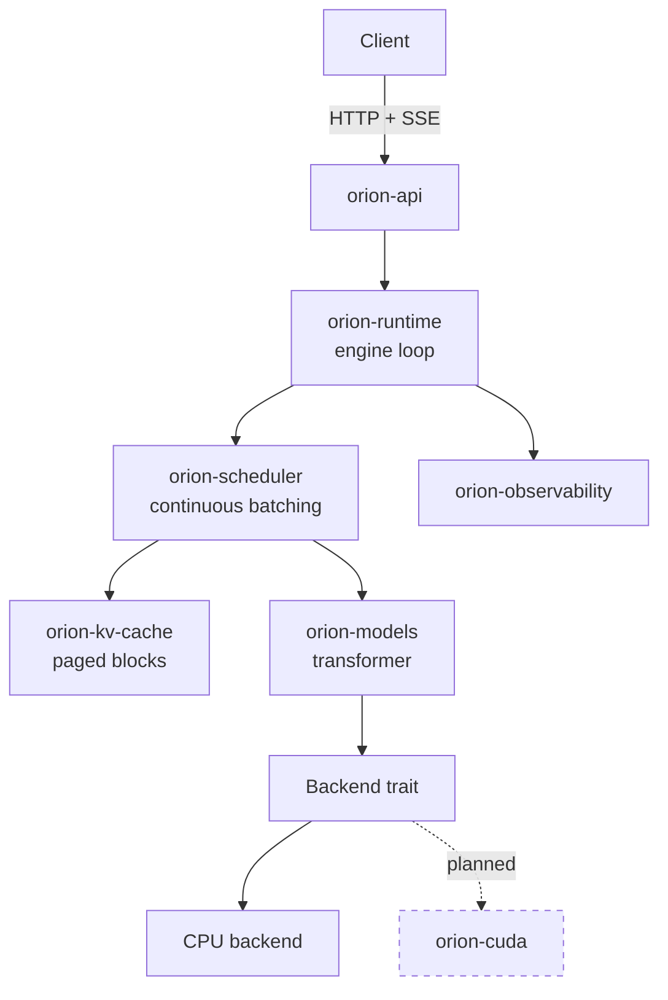

# OrionServe-RS

**A high-performance LLM inference engine in Rust — continuous batching, paged
KV cache, and prefix caching, built from the scheduler up.**

[](https://github.com/patowari/OrionServe-RS/actions/workflows/ci.yml)
[](LICENSE)
[](https://www.rust-lang.org)

> **Status: CPU inference works end to end.** A Hugging Face Llama or Qwen2
> checkpoint loads and serves over an OpenAI-compatible API with streaming.
> CUDA, quantization and multi-GPU are **not implemented** — see
> [the hardware note](#a-note-on-gpu-claims). The [feature table](#features) is
> the authoritative statement of what works, and no performance numbers are
> published beyond microbenchmarks that state the machine they ran on.

---

## Why this project

Serving a language model well is not mainly about matrix multiplication. It is
about three problems that have little to do with the model itself:

1. **Generation is sequential, but batching is essential.** Decoding one token
   reads every weight in the model to do a handful of matrix-vector products.
   A GPU serving one request is nearly idle. Batching is what makes the
   hardware worth its price.
2. **Requests are wildly heterogeneous.** Prompts span tens to tens of
   thousands of tokens. Output length is unknown until the model stops. Any
   scheme assuming uniformity wastes most of what it batches.
3. **KV cache dominates memory and cannot be sized in advance.** Llama-3-8B in
   FP16 costs 128 KiB of cache *per token*. One 8192-token sequence needs a
   gigabyte. Reserving each request's worst case leaves a GPU serving a
   handful of requests.

OrionServe-RS solves those three in Rust, with the reasoning written down. The
components where these problems live — the scheduler and the cache allocator —
depend on no GPU, no model, and no async runtime, so they are tested
exhaustively in milliseconds.

## Architecture



Full detail in [docs/architecture.md](docs/architecture.md).

## Features

**Working** — implemented, tested, documented:

| Feature                                                         | Where                                                       |
| --------------------------------------------------------------- | ----------------------------------------------------------- |
| Paged KV cache with reference counting                          | [`orion-kv-cache`](crates/orion-kv-cache)                  |
| Failure-atomic block allocation                                 | [`block.rs`](crates/orion-kv-cache/src/block.rs)           |
| Automatic prefix caching (chained hash, collision-verified)     | [`prefix.rs`](crates/orion-kv-cache/src/prefix.rs)         |
| Continuous batching scheduler                                   | [`orion-scheduler`](crates/orion-scheduler)                |
| Chunked prefill                                                 | [`scheduler.rs`](crates/orion-scheduler/src/scheduler.rs)  |
| Preemption with starvation-free recovery                        | [`queue.rs`](crates/orion-scheduler/src/queue.rs)          |
| Admission control and load shedding                             | [`scheduler.rs`](crates/orion-scheduler/src/scheduler.rs)  |
| Safetensors loading (sharded, memory-mapped)                    | [`loader.rs`](crates/orion-models/src/loader.rs)           |
| Llama / Qwen2 transformer on CPU                                | [`transformer.rs`](crates/orion-models/src/transformer.rs) |
| Paged attention with grouped-query attention                    | [`attention.rs`](crates/orion-models/src/attention.rs)     |
| Sampling: greedy, temperature, top-k, top-p, repetition penalty | [`sampling.rs`](crates/orion-runtime/src/sampling.rs)      |
| Incremental streaming decode (multi-byte safe)                  | [`orion-tokenizer`](crates/orion-tokenizer)                |
| OpenAI-compatible API with SSE streaming                        | [`orion-api`](crates/orion-api)                            |
| Prometheus metrics, structured logging                          | [`orion-observability`](crates/orion-observability)        |
| Load-generating benchmark harness                               | [`benchmarks`](benchmarks)                                 |

**Planned** — designed, not implemented. Nothing below runs today:

| Feature                                      | Notes                                                     |
| -------------------------------------------- | --------------------------------------------------------- |
| CUDA backend and custom kernels              | see the hardware note below                               |
| INT8 / INT4 quantization                     | design in[docs/quantization.md](docs/quantization.md)      |
| Multi-GPU tensor parallelism (NCCL)          | design in[docs/distributed.md](docs/distributed.md)        |
| Speculative decoding                         | design in[docs/distributed.md](docs/distributed.md)        |
| Swap-based preemption                        | `PreemptionMode::Swap` validates but is not implemented |
| Multiple completions per request (`n > 1`) | rejected with 400 rather than silently reduced            |

### A note on GPU claims

**No CUDA code has been written, and no GPU benchmark has been run.** The
development machine has no NVIDIA GPU and no CUDA toolkit — `nvcc` and
`nvidia-smi` are both absent. `orion-cuda` is a placeholder crate.

The CPU backend is a correctness reference, not a fast path: it is
straightforward scalar `f32` code and is deliberately unoptimized. When kernels
are written they will be validated against it before any performance claim is
made, and every published figure will state the hardware it came from.

## Quick start

```bash
git clone https://github.com/patowari/OrionServe-RS
cd OrionServe-RS
cargo build --release

# Inspect a model's configuration and KV cache footprint.
./target/release/orion inspect --model /path/to/model

# Serve it.
./target/release/orion serve \
  --model /path/to/model \
  --host 0.0.0.0 \
  --port 8000
```

Then:

```bash
curl http://localhost:8000/v1/chat/completions \
  -H 'Content-Type: application/json' \
  -d '{
    "model": "qwen",
    "messages": [{"role": "user", "content": "Explain tensor parallelism."}],
    "temperature": 0.7,
    "max_tokens": 200,
    "stream": true
  }'
```

Endpoints: `POST /v1/chat/completions`, `POST /v1/completions`,
`GET /v1/models`, `GET /health`, `GET /ready`, `GET /metrics`.

## Benchmarks

Two separate things, deliberately not conflated:

**Microbenchmarks** measure the data structures this project owns — the block
allocator, scheduler, prefix hashing, sampling. They are meaningful on any
machine because none of them touch a device:

```bash
cargo bench -p orion-bench
```

**Load testing** measures what a client experiences against a running server:
TTFT, TPOT, latency percentiles, throughput. Every result records the hardware
it was produced on and says plainly when a run was CPU-only:

```bash
orion serve --model /path/to/model &
orion-bench --url http://127.0.0.1:8000 --concurrency 1,10,50 --requests 100
```

See [benchmarks/README.md](benchmarks/README.md) for methodology and
[docs/benchmarking.md](docs/benchmarking.md) for what each metric means.

No comparison against vLLM, TGI or TensorRT-LLM is published, because a fair
comparison needs GPU hardware this project has not been run on. Putting a
CPU-only number beside their GPU numbers would be meaningless.

## Design documents

The reasoning matters more than the code. These explain *why*, including what
was rejected:

- [Architecture](docs/architecture.md) — components, boundaries, concurrency model
- [KV cache](docs/kv-cache.md) — memory arithmetic, block-size analysis, correctness guards
- [Scheduler](docs/scheduler.md) — batching, fairness, preemption, a real bug and its fix
- [Inference runtime](docs/inference-runtime.md) — the forward pass and its invariants
- [Benchmarking](docs/benchmarking.md) — methodology and what each metric means
- [CUDA](docs/cuda.md) — planned kernel work and how it will be validated
- [Distributed](docs/distributed.md) — planned tensor parallelism
- [Performance journal](docs/performance-journal.md) — every optimization, measured
- [ADRs](docs/adr/) — decision records with alternatives and consequences

## Development

Requires Rust 1.88+ — set by transitive dependencies, not by this code. No GPU
is needed for anything currently implemented.

```bash
cargo fmt --all --check
cargo clippy --workspace --all-targets --all-features -- -D warnings
cargo test --workspace
cargo build --release
```

All four must pass before a change lands. CI enforces them, plus an MSRV check,
a security audit and a documentation build.

### Project layout

```
crates/
  orion-core/          domain types, traits, errors, config
  orion-kv-cache/      block pool, block tables, prefix cache
  orion-scheduler/     queues, continuous batching, preemption
  orion-tokenizer/     HF tokenizer + incremental streaming decode
  orion-models/        checkpoint loading, transformer, paged attention
  orion-runtime/       engine loop, sampling
  orion-observability/ metrics, tracing
  orion-api/           OpenAI-compatible HTTP
  orion-cli/           the `orion` binary
  orion-distributed/   tensor parallelism                       (planned)
  orion-cuda/          CUDA backend and kernels                 (planned)
benchmarks/            load generator and microbenchmarks
docs/                  design documents and ADRs
```

## Roadmap

- [X] **M0 — Foundations.** Workspace, error architecture, domain model, CI.
- [X] **M1 — KV cache.** Block pool, block tables, prefix caching.
- [X] **M2 — Scheduler.** Continuous batching, chunked prefill, preemption.
- [X] **M3 — Model execution.** Safetensors loading, CPU transformer forward
  pass, paged attention.
- [X] **M4 — Serving.** Tokenizer, sampling, engine loop, OpenAI API, streaming.
- [X] **M5 — Observability.** Prometheus metrics, structured logging.
- [X] **M6 — Benchmarking.** Load generator, microbenchmarks, recorded hardware.
- [X] **M7 — CUDA.** Backend, then kernels, each validated against the CPU
  reference before any performance claim. **Blocked: no GPU available.**
- [X] **M8 — Quantization.** INT8, then INT4.
- [X] **M9 — Distributed.** Tensor parallelism across GPUs. **Blocked: no
  multi-GPU hardware.**

Milestones are sequential on purpose: correctness before optimization, and a
CPU reference before any kernel.

## Contributing

See [CONTRIBUTING.md](CONTRIBUTING.md). In short: every change keeps the four
quality gates green, new behaviour comes with tests, and performance claims
come with a reproducible measurement and the hardware it ran on.

## License

Apache 2.0 — see [LICENSE](LICENSE).
