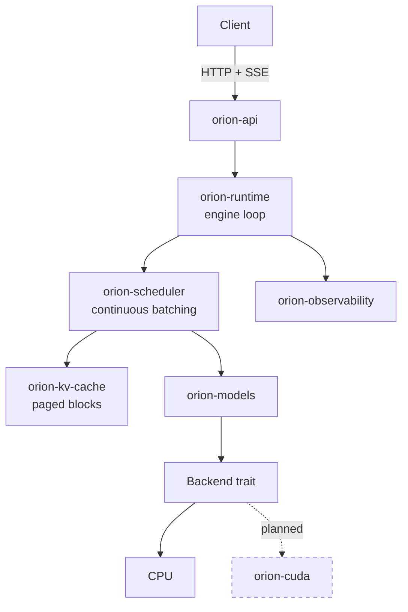

# OrionServe-RS

**A high-performance LLM inference engine in Rust — continuous batching, paged
KV cache, and prefix caching, built from the scheduler up.**

[](https://github.com/patowari/orionserve-rs/actions/workflows/ci.yml)
[](LICENSE)
[](https://www.rust-lang.org)

> **Status: early development.** The scheduler and KV cache are implemented and
> tested. Model execution, the HTTP API, and CUDA are not yet built. The
> [feature table](#features) below is the authoritative statement of what
> works. No benchmark numbers are published because none have been measured.

---

## Why this project

Serving a language model well is not mainly about matrix multiplication. It is
about three problems that have little to do with the model itself:

1. **Generation is sequential, but batching is essential.** Decoding one token
   reads every weight in the model to do a handful of matrix-vector products.
   A GPU serving one request is nearly idle. Batching is what makes the
   hardware worth its price.

2. **Requests are wildly heterogeneous.** Prompts span tens to tens of
   thousands of tokens. Output length is unknown until the model stops. Any
   scheme assuming uniformity wastes most of what it batches.

3. **KV cache dominates memory and cannot be sized in advance.** Llama-3-8B in
   FP16 costs 128 KiB of cache *per token*. One 8192-token sequence needs a
   gigabyte. Reserving each request's worst case leaves a GPU serving a
   handful of requests.

OrionServe-RS is an attempt to solve those three properly, in Rust, with the
reasoning written down. The components where these problems live — the
scheduler and the cache allocator — are built first and depend on no GPU, no
model, and no async runtime, so they can be tested exhaustively in milliseconds.

## Architecture



Full detail in [docs/architecture.md](docs/architecture.md).

## Features

**Stable** — implemented, tested, and documented:

| Feature | Where |
|---|---|
| Paged KV cache with reference counting | [`orion-kv-cache`](crates/orion-kv-cache) |
| Failure-atomic block allocation | [`block.rs`](crates/orion-kv-cache/src/block.rs) |
| Automatic prefix caching (chained hash, collision-verified) | [`prefix.rs`](crates/orion-kv-cache/src/prefix.rs) |
| Continuous batching scheduler | [`orion-scheduler`](crates/orion-scheduler) |
| Chunked prefill | [`scheduler.rs`](crates/orion-scheduler/src/scheduler.rs) |
| Preemption with starvation-free recovery | [`queue.rs`](crates/orion-scheduler/src/queue.rs) |
| Admission control and load shedding | [`scheduler.rs`](crates/orion-scheduler/src/scheduler.rs) |
| Sequence lifecycle state machine | [`orion-core`](crates/orion-core) |
| Validated configuration and sampling parameters | [`orion-core`](crates/orion-core) |

**In progress** — partially built:

| Feature | Notes |
|---|---|
| Model loading (safetensors + config.json) | crate scaffolded, loader not written |
| Sampling engine | parameters and validation done; samplers not written |

**Planned** — designed, not implemented. Nothing below currently runs:

| Feature | Notes |
|---|---|
| Transformer execution (RMSNorm, RoPE, GQA, SwiGLU) | design in [inference-runtime.md](docs/inference-runtime.md) |
| Tokenizer integration and streaming decode | — |
| OpenAI-compatible HTTP API with SSE streaming | — |
| Prometheus metrics and OpenTelemetry tracing | metric names listed in [docs/](docs/) |
| CUDA backend and custom kernels | see note on hardware below |
| INT8 / INT4 quantization | — |
| Multi-GPU tensor parallelism (NCCL) | — |
| Speculative decoding | — |

### A note on GPU claims

**No CUDA code has been written, and no GPU benchmark has been run.** The
development machine for this milestone has no NVIDIA GPU and no CUDA toolkit.
`orion-cuda` is an empty placeholder. When kernels are written they will be
validated against the CPU reference and benchmarked with explicit hardware
details recorded; until then this project claims no acceleration of any kind.

## Quick start

Nothing is servable yet — there is no model runtime and no HTTP surface. What
you can do today is run the engine's test suite:

```bash
git clone https://github.com/patowari/orionserve-rs
cd orionserve-rs

cargo test --workspace       # 140 tests, no GPU required
cargo clippy --workspace --all-targets --all-features -- -D warnings
```

The `orion serve` command is defined in the roadmap and is not implemented.

## Design documents

The reasoning matters more than the code. These explain *why*, including what
was rejected:

- [Architecture](docs/architecture.md) — components, boundaries, concurrency model
- [KV cache](docs/kv-cache.md) — memory arithmetic, block-size analysis, correctness guards
- [Scheduler](docs/scheduler.md) — batching, fairness, preemption, a real bug and its fix
- [ADRs](docs/adr/) — six decision records with alternatives and consequences

## Development

Requires Rust 1.82+. No GPU needed for anything currently implemented.

```bash
cargo fmt --check
cargo clippy --workspace --all-targets --all-features -- -D warnings
cargo test --workspace
cargo build --release
```

All four must pass before a change lands. CI enforces them.

### Project layout

```
crates/
  orion-core/          domain types, traits, errors, config
  orion-kv-cache/      block pool, block tables, prefix cache
  orion-scheduler/     queues, continuous batching, preemption
  orion-tokenizer/     HF tokenizer + incremental decode      (scaffold)
  orion-models/        checkpoint loading, transformer         (scaffold)
  orion-runtime/       engine loop, sampling                   (scaffold)
  orion-observability/ metrics, tracing                        (scaffold)
  orion-api/           OpenAI-compatible HTTP                  (scaffold)
  orion-distributed/   tensor parallelism                      (scaffold)
  orion-cuda/          CUDA backend and kernels                (scaffold)
  orion-cli/           the `orion` binary                      (scaffold)
docs/                  design documents and ADRs
```

## Roadmap

- [x] **M0 — Foundations.** Workspace, error architecture, domain model, CI.
- [x] **M1 — KV cache.** Block pool, block tables, prefix caching.
- [x] **M2 — Scheduler.** Continuous batching, chunked prefill, preemption.
- [ ] **M3 — Model execution.** Safetensors loading, transformer forward pass on
      CPU, verified against a reference implementation.
- [ ] **M4 — Serving.** Tokenizer, sampling, engine loop, OpenAI API, streaming.
- [ ] **M5 — Observability.** Prometheus metrics, tracing, structured logs.
- [ ] **M6 — Benchmarking.** Reproducible harness, recorded hardware, honest
      comparison against established engines.
- [ ] **M7 — CUDA.** Backend, then kernels, each validated against the CPU
      reference before any performance claim.
- [ ] **M8 — Quantization.** INT8, then INT4.
- [ ] **M9 — Distributed.** Tensor parallelism across GPUs.

Milestones are sequential on purpose: correctness before optimization, and a
CPU reference before any kernel.

## Contributing

See [CONTRIBUTING.md](CONTRIBUTING.md). In short: every change keeps the four
quality gates green, new behaviour comes with tests, and performance claims
come with a reproducible measurement and the hardware it ran on.

## License

Apache 2.0 — see [LICENSE](LICENSE).
