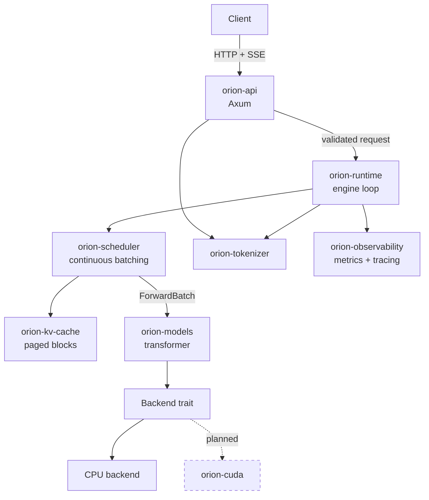
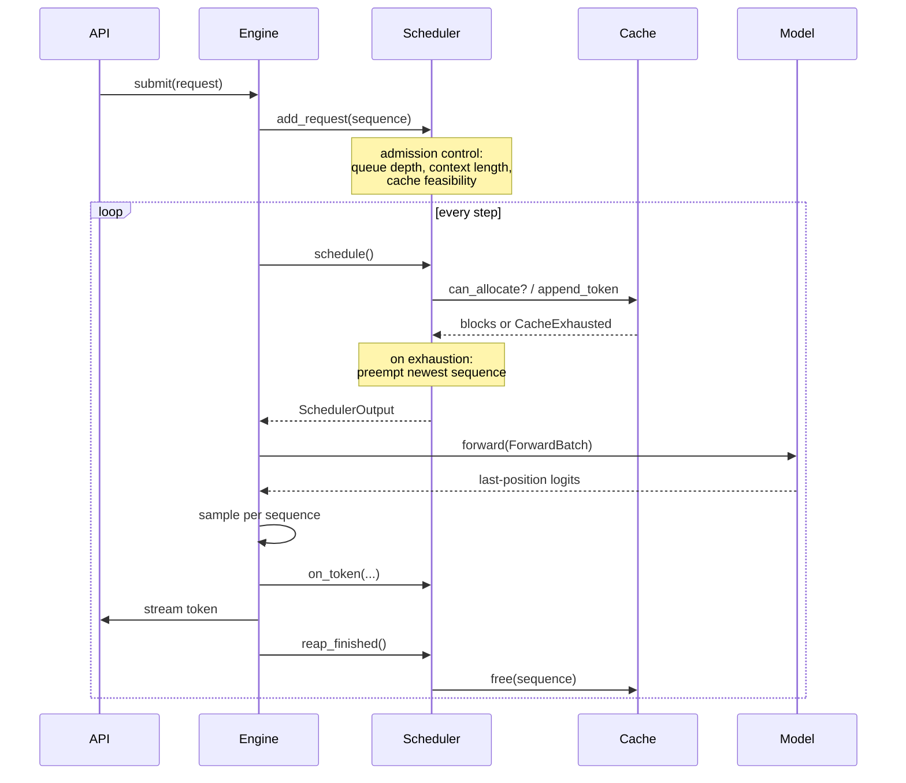

# Architecture

OrionServe-RS is an LLM inference engine. This document explains how it is
put together and, more importantly, why it is put together that way.

## The problem

Serving a decoder-only language model well is not primarily a matter of running
matrix multiplications quickly. The hard parts are elsewhere:

1. **Generation is sequential but batching is essential.** A single request
   decodes one token at a time, which uses a fraction of a GPU's arithmetic
   throughput. The GPU is idle waiting on memory. Batching many requests
   together is what makes the hardware worth its cost.

2. **Requests are heterogeneous and unpredictable.** Prompts vary from tens to
   tens of thousands of tokens. Output lengths are unknown until generation
   stops. A batching strategy that assumes uniformity wastes most of what it
   batches.

3. **The KV cache dominates memory, and its size is not known in advance.**
   Each sequence accumulates key and value tensors for every token, every
   layer. Reserving each request's worst case would leave a GPU serving a
   handful of requests.

Every major design decision below follows from one of these three.

## Component overview



## Crate boundaries

The workspace splits along lines of *what can be tested without what*. That is
a more useful criterion than subject matter, because it determines how fast the
test suite runs and how much of the system can be verified on a laptop.

| Crate | Responsibility | Depends on |
|---|---|---|
| `orion-core` | Domain types, traits, errors, config | nothing but serde/thiserror |
| `orion-kv-cache` | Block pool, block tables, prefix cache | core |
| `orion-scheduler` | Queues, continuous batching, preemption | core, kv-cache |
| `orion-tokenizer` | HF tokenizer, incremental decode | core |
| `orion-models` | Checkpoint loading, transformer layers | core |
| `orion-runtime` | Engine loop, sampling, batch execution | core + above |
| `orion-observability` | Metrics, tracing, logging | core |
| `orion-api` | OpenAI-compatible HTTP surface | core, runtime |
| `orion-distributed` | Tensor parallelism, collectives | core |
| `orion-cuda` | CUDA backend and kernels | core |
| `orion-cli` | The `orion` binary | all |

The critical property: **`orion-scheduler` and `orion-kv-cache` depend on no
model, no backend, and no GPU.** The scheduling policy and the memory allocator
— the two components where subtle bugs are most expensive and hardest to
reproduce — are fully exercised by unit tests that run in milliseconds on any
machine.

### Why `orion-core` depends on almost nothing

It is the shared vocabulary. If it pulled in `tokio`, every crate would inherit
an async runtime including ones that have no business having one. If it pulled
in a tensor library, the scheduler's tests would need one to link. The three
dependencies it does have (`serde`, `thiserror`, `uuid`) are all compile-time
or trivial.

## The engine loop

Inference proceeds in **steps**. Each step is one forward pass over one batch.



A step mixes prefill and decode work. That is the whole point of continuous
batching: there is no separate "prefill phase" during which decoding stops.

## Key design decisions

### Paged KV cache

Blocks of fixed size, handed out from a pool, addressed per sequence through a
block table. This is virtual memory applied to attention state, and it buys the
same thing: no external fragmentation, and no need to reserve a sequence's
worst case up front.

Detail and the block-size analysis: [kv-cache.md](kv-cache.md).

### Continuous batching with chunked prefill

Sequences join and leave the batch every step. A long prompt is split into
chunks so it cannot monopolize the GPU while short requests wait.

Detail and the fairness argument: [scheduler.md](scheduler.md).

### The scheduler owns no memory

The scheduler asks the cache manager whether a sequence fits, and tells it when
to allocate or free. It never touches a block itself. This means cache
accounting has exactly one home, and a scheduling bug cannot corrupt memory
bookkeeping.

### Ragged batches, not padded ones

`ForwardBatch` concatenates the token streams of every sequence end to end and
describes the boundaries with offset arrays. Padding a mixed prefill/decode
batch to its longest member would waste most of the compute — a batch with one
2000-token prefill and thirty 1-token decodes would do 62,000 token-slots of
work to accomplish 2,030.

### The model is immutable and shared

`LanguageModel::forward` takes `&self`. All mutable state — the KV cache — lives
outside the model. This is what makes it sound to share one set of weights
across worker threads without synchronization.

## Concurrency model

```text
   tokio tasks (many)              engine thread (one)
   ┌───────────────┐               ┌──────────────────┐
   │ HTTP handler  │──request──►   │  scheduler       │
   │               │               │  cache manager   │
   │               │ ◄──tokens───  │  model forward   │
   └───────────────┘   (channel)   └──────────────────┘
```

Request handling is asynchronous and concurrent. The **engine step loop is
single-threaded by design.**

That is a deliberate choice, not a limitation. The scheduler and cache manager
form a single consistent view of which sequence owns which block. Making them
concurrently mutable would require locking around every allocation decision,
and interleaved allocation decisions are exactly the race that produces
double-allocation and use-after-free bugs in a block allocator. The engine is
not CPU-bound on scheduling — it is bound on the forward pass — so serializing
the bookkeeping costs nothing measurable and removes an entire bug class.

Communication between the async layer and the engine uses **bounded** channels.
Bounded is what provides backpressure: when the engine falls behind, submission
blocks, and the API layer converts that into a `429` rather than accumulating
an unbounded queue that eventually exhausts memory.

## Error handling

Three error types, because each has a different correct response:

- `ConfigError` — operator error. Fatal at startup, with the offending field
  named.
- `ModelError` — bad or unsupported model artifact. Fatal at load.
- `EngineError` — per-request failure, classified by
  `is_client_error()` / `is_retryable()` so the HTTP layer maps status codes
  without string matching.

Internal invariant violations become `EngineError::Internal`, which is logged
in full and returned to the client as an opaque 500. Internal state never
leaks into an API response.

## What is not yet built

See the roadmap in [../README.md](../README.md) for current status. This
document describes the intended architecture; sections of it are still
`planned`, and the README's feature table is the authoritative statement of
what actually works today.
