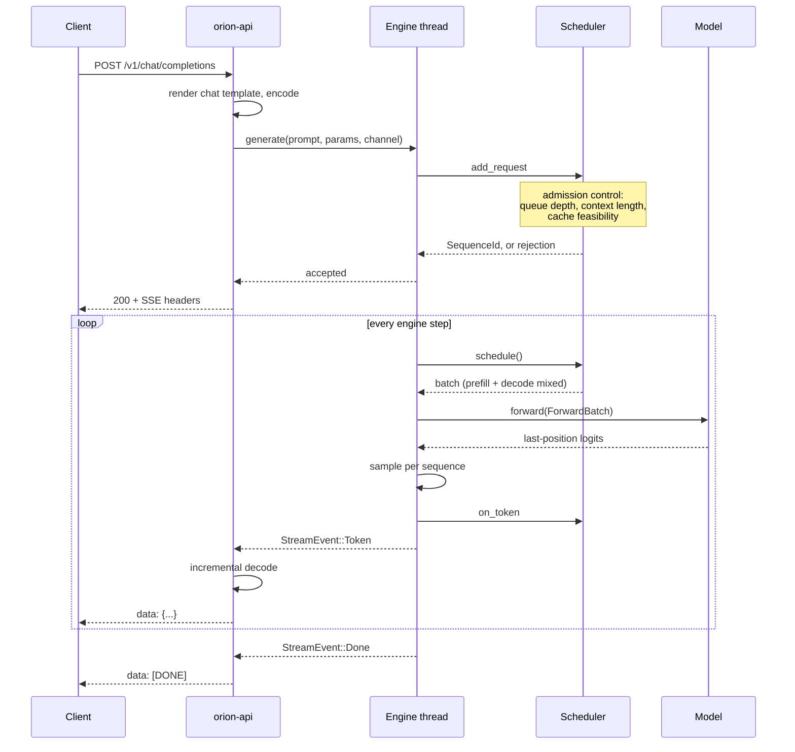

# Inference Runtime

How a request becomes tokens, and the invariants that keep it correct.

## The path of one request



## The engine step

One step is one forward pass over one batch. The batch mixes prefill and decode
work — that is what continuous batching means.

```rust
// crates/orion-runtime/src/engine.rs
pub fn step(&mut self) -> Result<usize, EngineError> {
    // 1. Retire anything past its deadline before doing new work.
    // 2. Ask the scheduler for a batch.
    // 3. Build the flat ForwardBatch from the scheduled sequences.
    // 4. Run the model.
    // 5. Sample one token per sequence that finished prefilling.
    // 6. Publish completed prefills to the prefix cache.
    // 7. Reap finished sequences, freeing their blocks.
}
```

Step 5's condition matters: a sequence part-way through chunked prefill produces
logits for a position mid-prompt, which are not a prediction of anything. The
engine skips them rather than sampling nonsense.

Step 6 happens **after** the forward pass, never before. Publishing at
allocation time would let another sequence adopt blocks holding uninitialized
memory — see `docs/kv-cache.md`.

## Ragged batches

`ForwardBatch` concatenates every sequence's tokens end to end and describes the
boundaries with parallel offset arrays. There is no padding.

```text
tokens:             [a1 a2 a3 | b1 | c1 c2]
positions:          [ 0  1  2 |  7 |  0  1]
slot_token_counts:  [    3    |  1 |    2 ]
sequence_ids:       [    A    |  B |    C ]
context_lens:       [    3    |  8 |    2 ]
```

A padded batch would be sized to its longest member. A batch with one
2000-token prefill and thirty 1-token decodes would do 62,000 token-slots of
work to accomplish 2,030 — over 96% waste. Offsets cost a little index
arithmetic and avoid all of it.

`ForwardBatch::validate` checks the parallel-array invariants. A violation would
otherwise surface as silent numerical garbage deep inside a kernel, so it is
checked at the boundary where the arrays are built.

## Only last-position logits

`forward` returns one logits row per *sequence*, not per token.

Sampling needs one distribution per sequence. Materializing
`[num_tokens, vocab_size]` for a long prefill would be enormous — a 2000-token
prompt against a 128k vocabulary is 256 million floats, a gigabyte, to read 128k
of it.

## Invariants

These are what the tests actually pin, and why:

**Batching does not change results.** A sequence's logits must not depend on
what else was in the batch. Pinned by
`batched_sequences_do_not_influence_each_other`. Without it, continuous batching
would be unsound.

**Incremental decode equals full prefill.** Feeding tokens one at a time gives
the same answer as processing them together. Pinned by
`incremental_decode_matches_a_full_prefill`. This is the KV cache's correctness
condition, stated executably.

**Chunking does not change results.** A prompt split across steps gives the same
logits as one processed whole. Pinned by
`chunked_prefill_matches_a_single_pass`.

**Paging is invisible.** A scattered block table gives identical logits to a
contiguous one. Pinned by `a_scattered_block_table_gives_identical_logits`.

**Streaming equals non-streaming.** The SSE path and the collected path produce
the same text byte for byte. Pinned by `streaming_and_non_streaming_agree`.

## Sampling

Kept entirely separate from model execution, so every filter can be driven
against a hand-written logits row with a known answer.

Filter order is not arbitrary:

```text
repetition penalty   (raw logits, sign-aware)
    -> temperature   (before any probability is formed)
        -> top-k     (cheap, shrinks the candidate set)
            -> top-p (needs a normalized distribution)
                -> sample
```

Repetition penalty first because it is defined on raw logits; applying it after
temperature would make its strength depend on temperature. Top-k before top-p
because it is O(n) and cheaply shrinks what top-p must sort.

Each request owns its RNG, so a seeded request is reproducible regardless of how
many others are in flight. A shared global RNG would make output depend on
interleaving.

See `docs/performance-journal.md` entry 001 for the 10x speedup that came from
noticing these filters were each unaware of what the previous one had already
eliminated.

## Streaming decode

Naively decoding each token and emitting the result is wrong twice over:
multi-byte characters span tokens, and byte-level BPE detokenization is
context-sensitive.

`IncrementalDecoder` decodes a window from a fixed anchor and emits whatever
extends past the byte count already sent. A partial character simply produces
more text on the next decode, so held-back bytes reappear on their own.

Detokenization deliberately lives in the API layer, not the engine, so it never
blocks the step loop. The engine emits token ids; text is the API's problem.

## Cancellation

A disconnected client must stop consuming compute.

The SSE stream owns the receiver. When the client goes away the stream is
dropped, dropping the receiver. The engine's next `try_send` fails, and it
cancels the sequence and frees its blocks.

Pinned by `a_disconnected_caller_has_its_request_cancelled`, which asserts both
that the engine stops working and that the blocks come back.

## Threading

One engine thread (ADR 006). The scheduler and cache manager are owned outright
and mutated through `&mut self`, with no locking.

Async request handlers talk to it over **bounded** channels. Bounded is what
provides backpressure: when the engine falls behind, submission blocks, and the
API layer converts that into a 429 rather than accumulating an unbounded queue.

`TransformerModel` holds its KV store behind a `Mutex` to satisfy `Sync` for the
shared-model case. It is uncontended in practice — there is exactly one caller —
and the doc comment says so, to stop a future reader mistaking it for a hot
lock.

## Failure handling

A step failure is logged and the loop continues. One bad batch must not take
down a server that is otherwise healthy.

Per-request failures reach the client as a terminal stream event.
`EngineError::Internal` is logged in full and surfaced as an opaque 500 —
internal state never leaks into an API response.
