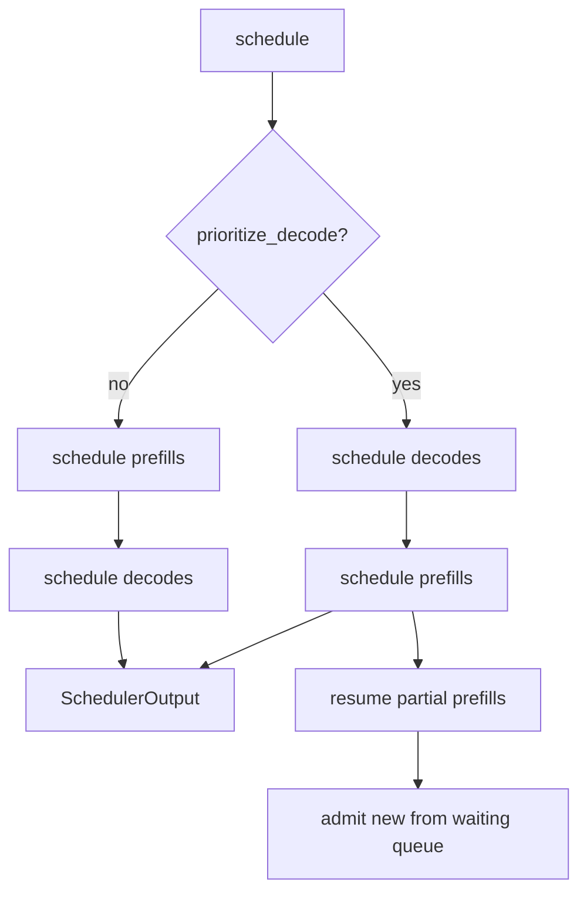

# Scheduler Design

## Why scheduling is the hard part

A GPU running a single decoding sequence is almost entirely idle. Generating one
token requires reading every weight in the model to perform a handful of
matrix-vector products — the arithmetic intensity is terrible, and the hardware
spends its time waiting on memory.

Running 64 sequences together reads those same weights **once** and does 64
times the arithmetic. Throughput improves by close to the batch size until
something else becomes the bottleneck.

So the scheduler's job is to keep batches full. Everything below follows from
that, plus the constraint that filling batches must not make any individual
request unacceptably slow.

## Static batching and why it is not enough

The naive approach forms a batch, runs it to completion, then forms the next.

```text
Static batching — time flows right

Req A (3 tokens)  ████░░░░░░░░░░░░░░  ← finished, slot wasted
Req B (5 tokens)  ██████░░░░░░░░░░░░  ← finished, slot wasted
Req C (18 tokens) ██████████████████
Req D (arrives)   ░░░░░░░░░░░░░░░░░░██████  ← waits for the whole batch
                                    ↑
                            batch finally completes
```

Two costs, both severe:

1. **Slot waste.** A batch runs until its *longest* member finishes. Output
   lengths vary by an order of magnitude, so most slots sit idle most of the
   time.
2. **Head-of-line blocking.** An arriving request waits for the entire current
   batch, however long its own prompt is.

## Continuous batching

Sequences join and leave the batch **every step**.

```text
Continuous batching

Step:      1    2    3    4    5    6    7
Req A      █    █    █    ✓
Req B      █    █    █    █    █    ✓
Req C      █    █    █    █    █    █    █
Req D           →    █    █    █    █    █   ← joins at step 2
Req E                          →    █    █   ← joins as A's slot frees
```

A finished sequence frees its slot immediately. A new request joins at the next
step. There is no "batch boundary" to wait for.

## The step

Each call to `Scheduler::schedule` produces one `SchedulerOutput` — the batch
for one forward pass.



### Decode-first, by default

Running sequences get their one token each before any new prompt is admitted.

The reasoning is about *perceived* latency. A client already streaming tokens
notices a stall immediately — inter-token latency is visible as stutter. A
client whose request has not started yet only experiences time-to-first-token,
which is a single number they cannot compare against anything.

Prefill-first improves TTFT for new arrivals at the cost of visible stutter for
everyone already streaming. Both orders are implemented and selected by
`prioritize_decode`; the default favours the running set.

### The token budget

`max_num_batched_tokens` bounds the total tokens in a step. This is the primary
throughput/latency dial:

- **Larger** — bigger batches, better GPU utilization, higher throughput; but a
  step takes longer, so every sequence's inter-token latency rises.
- **Smaller** — snappier per-token latency, worse hardware utilization.

`max_num_seqs` separately bounds how many sequences may be resident, since each
one costs cache blocks and per-sequence state regardless of its token count.

Config validation rejects `max_num_batched_tokens < max_num_seqs`: a
decode-only step could not give every running sequence even one token, which
guarantees starvation.

## Chunked prefill

A 32,000-token prompt in one step would stall every streaming client for the
duration of that forward pass. Chunked prefill splits it:

```text
Without chunking — one client's long prompt stalls everyone

Step 1: [ prompt X: 8192 tokens ................................ ]
        other sequences: no tokens generated this step

With chunking (budget 2048)

Step 1: [ X:2044 ][ A:1 ][ B:1 ][ C:1 ][ D:1 ]
Step 2: [ X:2044 ][ A:1 ][ B:1 ][ C:1 ][ D:1 ]
Step 3: [ X:2044 ][ A:1 ][ B:1 ][ C:1 ][ D:1 ]
Step 4: [ X:2060 ][ A:1 ][ B:1 ][ C:1 ][ D:1 ]
```

X's TTFT is slightly worse than it would have been alone. Everyone else keeps
streaming. That is the intended trade.

### The stranded-sequence bug

Chunked prefill introduced a real bug during development, worth recording
because the shape of it is easy to reproduce.

After its first chunk, a sequence moves into the running queue in state
`Prefilling`. But the decode path only selects `Decoding` sequences, and the
prefill path only reads from the *waiting* queue. A partially-prefilled
sequence belonged to neither, and stalled permanently — the request simply hung.

The fix is `schedule_partial_prefills`, which resumes in-progress prefills
before admitting new ones. Partial prefills are resumed first deliberately:
work already started is already holding cache blocks, and finishing it releases
those blocks sooner than starting more work would.

Pinned by `a_partially_prefilled_sequence_is_never_stranded`, and by
`every_admitted_request_eventually_finishes`, which drives a mixed workload to
completion and asserts nothing is dropped or deadlocked.

## Preemption

When the cache cannot grow for a decoding sequence, something must give.

**Victim policy: newest first.** The most recently admitted sequence has
generated the fewest tokens, so evicting it discards the least completed work.

**Recovery: front of the queue.** A preempted sequence goes to the *front* of
the waiting queue, not the back. This is the single most important fairness
property in the scheduler. Sending it to the back would let a steady arrival
stream starve it indefinitely, repeatedly throwing away its prefill work —
livelock that looks like a hung request.

Pinned by `preempted_sequences_regain_priority` and
`repeated_preemption_cannot_starve_a_sequence`, which simulates ten
preempt-and-new-arrival rounds and asserts the victim still runs first.

**What is lost.** Preemption discards prefill progress but **keeps generated
tokens** — on restart, the prompt becomes prompt + tokens-so-far. No output is
ever lost; only recomputable work is.

### Recompute versus swap

| | Recompute (default) | Swap (planned) |
|---|---|---|
| Cost | Re-run prefill | PCIe copy out and back |
| Wins when | Prompt is short | Prompt is long |
| Extra memory | None | CPU block pool |

Recompute is the default because it needs no host memory and no transfer path,
and because prefill is fast on a GPU. `PreemptionMode::Swap` is defined and
validated but not implemented — `CacheConfig::num_cpu_swap_blocks` must be
non-zero if it is selected, which config validation enforces.

## Admission control

Three rejections happen at `add_request`, before a sequence ever enters a
queue:

1. **Queue depth** — `QueueFull`, retryable, maps to 429. Refusing immediately
   beats accepting unbounded work and timing everything out later.
2. **Context length** — `ContextLengthExceeded`, a client error, maps to 400.
3. **Larger than the entire cache** — `CacheExhausted`. This one is subtle: a
   prompt that cannot fit even an empty cache will *never* be schedulable, so
   admitting it would park it at the queue head forever, blocking every request
   behind it.

## Timeouts

Checked once per step by scanning the running and waiting sets, rather than by
registering a timer per request. One linear scan over a bounded set is cheaper
than thousands of timer registrations and cancellations, and the resolution —
one engine step — is far finer than any useful request deadline.

## Complexity

Per step, with *R* running and *W* waiting sequences:

| Operation | Cost |
|---|---|
| Decode scheduling | O(R) |
| Partial prefill resumption | O(R) |
| New admissions | O(k) for k admitted |
| Preemption | O(1) amortized |
| Timeout scan | O(R + W) |
| Cancellation | O(R + W) |

Everything is linear in resident sequences, which `max_num_seqs` bounds. There
is no sort and no priority queue: FIFO ordering is what provides the fairness
guarantee, and imposing a priority order would break it.

## Testability

The scheduler is generic over `KvCacheManagerLike`. Its tests run against:

- the **real** `KvCacheManager`, so policy tests exercise genuine allocation,
  reference counting, and exhaustion arithmetic;
- `FakeCache`, which forces allocation failure on demand, so error-path tests
  are about the scheduler's reaction rather than about contriving the block
  arithmetic that triggers it.

No GPU, no model, no async runtime. 39 tests, milliseconds.

## Status

| Feature | State |
|---|---|
| Continuous batching | implemented |
| Token and sequence budgets | implemented |
| Chunked prefill | implemented |
| Preemption by recompute | implemented |
| FIFO fairness with preemption priority | implemented |
| Admission control and load shedding | implemented |
| Per-step timeout expiry | implemented |
| Preemption by swap | planned |
| Priority classes / SLO-aware scheduling | planned |
| Speculative decoding integration | planned |
